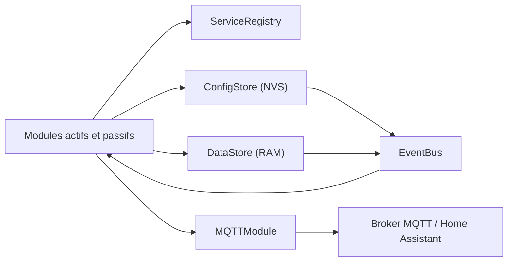

# Architecture Core

Cette page décrit l'architecture actuellement utilisée par les firmwares `FlowIO` et `Supervisor`.

## Blocs runtime

Le runtime est organisé autour des briques suivantes:

- `Module` et `ModulePassive`: cycle de vie des modules
- `ModuleManager`: enregistrement, tri topologique, `init`, `onConfigLoaded`, `onStart`, démarrage séquencé des tâches
- `ServiceRegistry`: registre de services indexé par `ServiceId`
- `ConfigStore`: configuration persistante en NVS avec import/export JSON
- `DataStore`: état runtime partagé en RAM
- `EventBus`: signalisation interne via queue
- `MQTTModule`: transport MQTT unifié

Les noms texte visibles dans les logs, comme `mqtt`, `io` ou `time.scheduler`, correspondent à `toString(ServiceId)`. Le wiring réel passe par `ServiceId`.

## Organisation des échanges

### Services

Les dépendances inter-modules passent par des services C simples:

- contrat structuré de pointeurs de fonctions
- champ `ctx`
- enregistrement dans `ServiceRegistry`

Le champ `ctx` est le pointeur de contexte du service.

Dans l'implémentation actuelle, il pointe le plus souvent vers l'instance du module qui porte le service. Les fonctions du contrat reçoivent ce pointeur en premier argument, puis le recastent vers le type attendu pour accéder à l'état interne du module sans exposer directement la classe C++ dans le contrat public.

Exemple de principe:

```cpp
struct MyService {
    bool (*doThing)(void* ctx, int value);
    void* ctx;
};
```

Le nom `ctx` est l'abréviation de `context`. Ce nom est utilisé parce que les services sont définis comme des interfaces C légères basées sur des pointeurs de fonctions. Dans ce modèle, `ctx` joue le rôle d'instance associée au contrat, de la même manière qu'un `this` implicite dans une méthode C++.

Le champ `ctx` n'est pas fortement typé: son type public est toujours `void*`. Le respect du contrat repose donc sur le développeur au moment de l'initialisation du service et du cast effectué dans les callbacks. Si un service reçoit un `ctx` qui ne correspond pas au type attendu, l'erreur ne sera pas bloquée par le compilateur et le comportement en exécution devient indéfini.

### Configuration

La configuration persistante suit ce chemin:

1. déclaration des variables par les modules
2. chargement NVS dans `ConfigStore`
3. exposition JSON par module
4. publication `EventId::ConfigChanged` lors d'une modification

### Runtime

L'état runtime suit ce chemin:

1. écriture dans `DataStore`
2. publication `EventId::DataChanged`
3. consommation éventuelle par d'autres modules
4. publication MQTT uniquement si un provider runtime MQTT est enregistré et si au moins une route déclarée par ce provider est concernée par la `DataKey` modifiée

## Flux principal


```mermaid
flowchart LR
  A["Modules actifs et passifs"] --> B["ServiceRegistry"]
  A --> C["ConfigStore (NVS)"]
  A --> D["DataStore (RAM)"]
  C --> E["EventBus"]
  D --> E
  E --> A
  A --> F["MQTTModule"]
  F --> G["Broker MQTT / Home Assistant"]
```

## Démarrage

Séquence de démarrage commune:

1. `Bootstrap::run()` résout le profil compilé
2. le profil installe `board`, `domain`, `identity` et options runtime dans `AppContext`
3. le profil enregistre ses modules dans `ModuleManager`
4. `ModuleManager::initAll()` exécute:
   - `init()`
   - `ConfigStore::loadPersistent()`
   - `onConfigLoaded()`
   - préparation du séquenceur de démarrage non bloquant
5. `Bootstrap::loop()` appelle `ModuleManager::tickStartup()`, qui relâche progressivement chaque module:
   - quand `startDelayMs()` est écoulé
   - et quand toutes ses dépendances ont déjà été relâchées
6. lors du relâchement d'un module, `ModuleManager` appelle `onStart()`, puis démarre ses tâches éventuelles

Ce mécanisme s'applique aussi aux modules passifs. Un module sans tâche peut donc déplacer son setup métier de `onConfigLoaded()` vers `onStart()` s'il doit être exécuté à un moment précis du boot.

Dans `FlowIO`, le bootstrap enregistre ensuite les providers runtime MQTT et Runtime UI du profil.

### Delais de sequencement retenus

| Module | Delai (ms) | Effet |
| --- | ---: | --- |
| `eventbus` | `0` | disponibilité immédiate; `SystemStarted` est désormais posté depuis `onStart()` |
| `mqtt` | `1500` | conserve le relâchement différé historique avant les tentatives de connexion |
| `poollogic` | `10000` | conserve le démarrage différé historique de la boucle métier |
| `ha` | `15000` | conserve le démarrage différé historique de l'auto-discovery Home Assistant |
| `webinterface` | `10000` | conserve l'ancien warm-up fixe du serveur web Supervisor, désormais porté par `ModuleManager` |
| autres modules | `0` | relâchement immédiat après `onConfigLoaded()` sauf override explicite |

## Répartition actuelle des responsabilités

### `FlowIO`

Le profil `FlowIO` porte notamment:

- `wifi`
- `time`
- `mqtt`
- `ha`
- `io`
- `poollogic`
- `pooldev`
- `hmi`
- `i2ccfg.server`

### `Supervisor`

Le profil `Supervisor` porte notamment:

- `wifi`
- `wifiprov`
- `i2ccfg.client`
- `webinterface`
- `fwupdate`
- `hmi.supervisor`

## Chaîne de logs

La chaîne de logs actuelle est:

1. `LogHubModule`: buffer et registre de modules de log
2. `LogDispatcherModule`: distribution vers les sinks
3. `LogSerialSinkModule`: sortie série
4. `LogAlarmSinkModule`: conversion de certains logs en alarmes

Le logging fonctionne de manière asynchrone. Les modules produisent des entrées de log et les poussent dans le buffer central porté par `LogHubModule`. Ces entrées sont ensuite consommées par `LogDispatcherModule`, qui les redistribue vers les sinks enregistrés. Chaque sink applique ensuite son propre traitement, par exemple l'émission sur le port série pour `LogSerialSinkModule` ou la transformation en alarmes pour `LogAlarmSinkModule`.

## Transport MQTT

Le chemin MQTT utilisé aujourd'hui est job-based:

- les modules enregistrent des producteurs
- les modules enqueuent des jobs `(producerId, messageId, priorité)`
- `MQTTModule` construit le topic et le payload au moment de la publication
- les retries et le backoff sont centralisés dans le module MQTT
