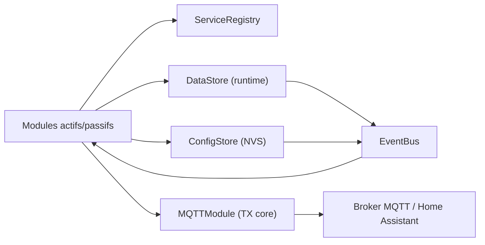

# Architecture Core

## Principes

Flow.IO suit une architecture modulaire orientée contrats:
- chaque module déclare ses dépendances (`dependencyCount`, `dependency`)
- les interactions passent par des services typés (`ServiceRegistry`)
- les changements runtime passent par `DataStore` + `EventBus`
- la config persistante passe par `ConfigStore` (NVS) + `ConfigChanged`
- le transport MQTT TX est centralisé dans `MQTTModule` (cœur unifié job-based)

## Composants clés

- `ModuleManager`: tri topologique, `init`, `onConfigLoaded`, démarrage tasks
- `ServiceRegistry`: registre de services par ID string (`add/get<T>()`)
- `EventBus`: queue thread-safe, dispatch callback
- `DataStore`: état runtime centralisé + événements `DataChanged`
- `ConfigStore`: variables config déclarées par modules, NVS, JSON import/export
- `MQTTModule`: coeur TX MQTT unifié (queues/jobs/retry/publish)
- `MqttConfigRouteProducer`: helper technique pour producteurs cfg autoportés

## Chaîne de logs

- `LogHubModule`: buffer central
- `LogDispatcherModule`: dispatch vers sinks
- `LogSerialSinkModule`: sortie série
- `LogAlarmSinkModule`: conversion warn/error en alarmes

## Flux principal

```mermaid
flowchart LR
  A["Modules actifs/passifs"] --> B["ServiceRegistry"]
  A --> C["ConfigStore (NVS)"]
  A --> D["DataStore (runtime)"]
  D --> E["EventBus"]
  C --> E
  E --> A
  A --> F["MQTTModule (TX core)"]
  F --> G["Broker MQTT / Home Assistant"]
```

## Séquence de boot

1. `Preferences.begin("flowio")`
2. injection `Preferences` dans `ConfigStore`
3. migrations éventuelles (`runMigrations`)
4. enregistrement modules dans `ModuleManager`
5. `initAll()`
- `init()` modules (ordre topologique)
- `loadPersistent()`
- `onConfigLoaded()`
- start tasks modules actifs
6. câblage providers runtime MQTT (`registerRuntimeProvider(...)`)
7. orchestrateur de boot progressif (release MQTT/HA/PoolLogic)

## Chemin MQTT unifié (résumé)

- les modules s'enregistrent comme producteurs (`MqttPublishProducer`)
- les modules enqueuent des jobs compacts `(producerId,messageId,prio)`
- le cœur MQTT choisit, build, publie, puis notifie (`published/deferred/dropped`)
- retry/backoff et déduplication sont centralisés
- aucun pipeline MQTT alternatif en parallèle

## Règles d'intégration recommandées

- dépendre de services, pas d'implémentations concrètes
- utiliser les helpers runtime `*Runtime.h` pour notifier `DataStore`
- utiliser `ConfigStore::set()` pour persistance + `ConfigChanged`
- garder les callbacks EventBus courts et non bloquants
- côté MQTT, enqueuer par IDs, ne pas publier directement topic/payload
