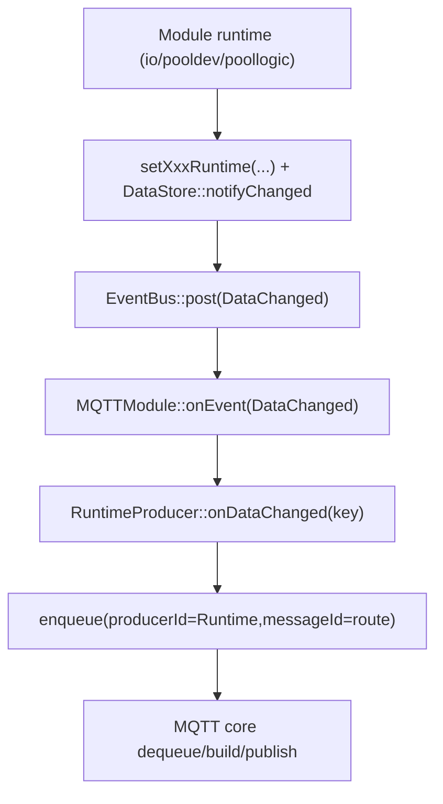
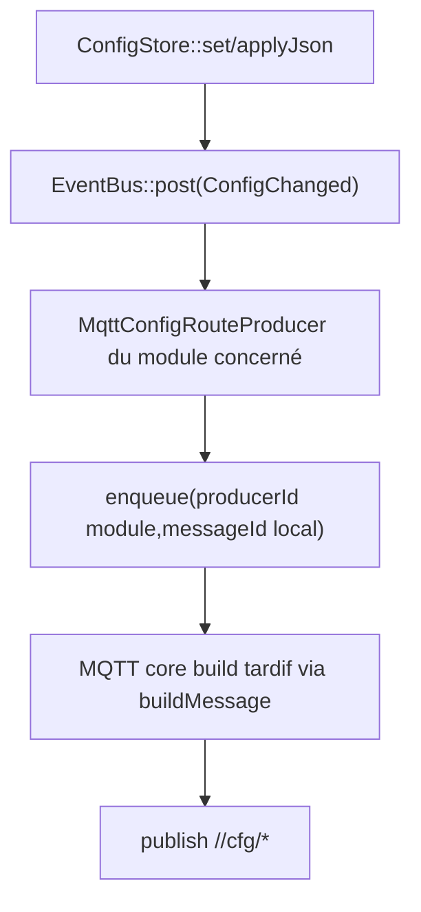

# DataStore / EventBus / MQTT (état actuel)

## Introduction

Flow.IO sépare les responsabilités en 4 blocs:
1. `ConfigStore`: configuration persistante (NVS)
2. `DataStore`: état runtime RAM (`RuntimeData`)
3. `EventBus`: signalisation asynchrone (payload max `48` octets)
4. `MQTTModule`: transport MQTT unifié job-based

## Contrats clés

- `DataChangedPayload`:
  - `DataKey id`
- `ConfigChangedPayload`:
  - `moduleId` (8 bits)
  - `localBranchId` (8 bits)
  - `nvsKey`, `module` (traces/debug)
- `IRuntimeSnapshotProvider`:
  - `runtimeSnapshotCount()`
  - `runtimeSnapshotSuffix()`
  - `runtimeSnapshotClass()`
  - `runtimeSnapshotAffectsKey()`
  - `buildRuntimeSnapshot()`
- `MqttPublishProducer`:
  - `buildMessage(...)`
  - callbacks published/deferred/dropped

## DataStore: mécanique exacte

Écriture runtime standard:
1. un module met à jour `RuntimeData` via helper `set...`
2. le helper appelle `DataStore::notifyChanged(key)`
3. `DataStore` publie `EventId::DataChanged`

Important:
- pas de store d'événements persistant
- EventBus est volatil, queue-borné

## ConfigStore: mécanique exacte

1. module déclare ses variables (`registerVar`)
2. moduleId/localBranchId sont stockés avec chaque variable
3. `ConfigStore::set/applyJson` persiste puis publie `EventId::ConfigChanged`

Le routage métier config vers MQTT reste local aux modules (producteurs cfg).

## Flow runtime -> MQTT

## Flow config -> MQTT

## Politique runtime

- routes `ActuatorImmediate`: priorité haute
- routes `NumericThrottled`: priorité normale + throttling local (`10 s`)
- coalescing par `(producerId,messageId)` dans le cœur
- retry/backoff transport géré au centre MQTT

## Politique config

- producteurs cfg module-owned
- pending/retry local via `MqttConfigRouteProducer`
- timeout route cfg après refus prolongé (`10 s`)
- métriques `cfgq ...` toutes les `5 s` quand actif

## Points de surveillance runtime

- EventBus:
  - `post stats 5s: ...` (`DEBUG`, `WARN` si drops > 0)
  - `sub stats 5s: ...` (`DEBUG`, `WARN` si rejets/capacité)
  - `sub reject ...`
- MQTT:
  - `queue occ max/boot ...` (`DEBUG`, métrologie max boot)
  - `enqueue reject ...`
  - `cfgq ...` (`DEBUG`, `WARN` si `tto > 0`)
