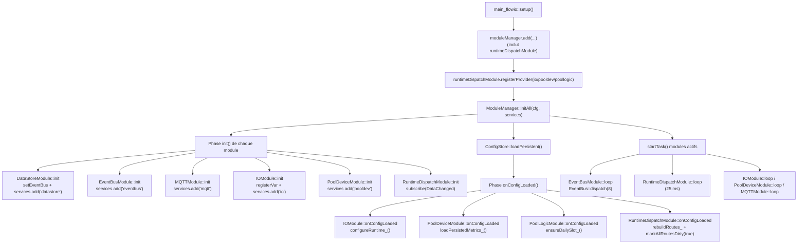
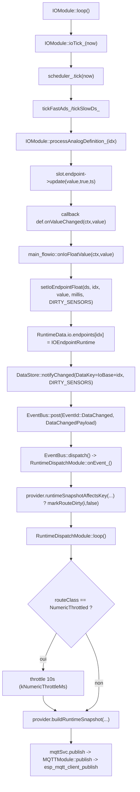
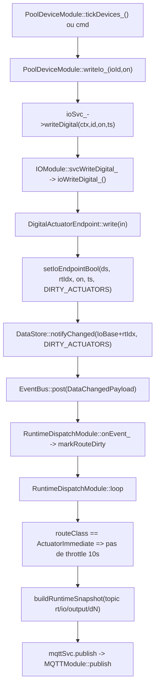

# DataStore et Flux Runtime (état actuel)

## Introduction

Flow.IO sépare les responsabilités en 4 blocs:
1. `ConfigStore`: configuration persistante (NVS), chargée au boot puis modifiable.
2. `DataStore`: état runtime en RAM (`RuntimeData`).
3. `EventBus`: signalisation asynchrone (`EventId`, payloads bornés à 48 octets).
4. `RuntimeDispatchModule`: décision de publication runtime MQTT (throttle, immédiat, retry).

Ce document décrit le **flux réellement implémenté** après le refactor big-bang runtime.

## Structures et contrats clés

- `RuntimeData` (agrégat): `wifi`, `time`, `mqtt`, `ha`, `io`, `pool`.
- `DataKey` (`include/Core/DataKeys.h`): identifiants stables des champs runtime.
- `DataChangedPayload`:
  - `DataKey id`
  - `uint32_t dirtyFlags`
- `DirtyFlags`:
  - `DIRTY_NETWORK`, `DIRTY_TIME`, `DIRTY_MQTT`, `DIRTY_SENSORS`, `DIRTY_ACTUATORS`.
- `IRuntimeSnapshotProvider`:
  - `runtimeSnapshotCount()`
  - `runtimeSnapshotSuffix()`
  - `runtimeSnapshotClass()`
  - `runtimeSnapshotAffectsKey()`
  - `buildRuntimeSnapshot()`
- `RuntimeRouteClass`:
  - `NumericThrottled`
  - `ActuatorImmediate`

## DataStore: mécanique exacte

Écriture runtime standard:
1. un module met à jour `RuntimeData` via un helper `set...`.
2. le helper appelle `DataStore::notifyChanged(key, dirtyMask)`.
3. `DataStore::notifyChanged()` publie `EventId::DataChanged` avec `DataChangedPayload{id, dirtyFlags}`.

Important:
- `DataSnapshotAvailable` n'est plus utilisé.
- il n'y a plus de `_dirtyFlags` cumulatif dans `DataStore`.

## Flowchart 1: enregistrements au démarrage

### Fonctions impliquées (startup)

- `main_flowio::setup()`
- `ModuleManager::initAll()`
- `ConfigStore::loadPersistent()`
- `Module::init()` / `Module::onConfigLoaded()` / `Module::startTask()`
- `RuntimeDispatchModule::registerProvider()`
- `RuntimeDispatchModule::rebuildRoutes_()`
- `RuntimeDispatchModule::markAllRoutesDirty(true)`

### Structures manipulées (startup)

- `ServiceRegistry`
- `ConfigStore` / `ConfigVariable<>`
- `RuntimeDispatchModule::providers_[]`
- `RuntimeDispatchModule::routes_[]` (`RouteEntry`)
- `EventBus` (`QueuedEvent`)

## Flowchart 2: changement d'un état numérique runtime

Exemple typique: mesure analogique (`rt/io/input/aN`).

### Fonctions impliquées (numérique)

- `IOModule::processAnalogDefinition_()`
- `main_flowio::onIoFloatValue()`
- `setIoEndpointFloat()`
- `DataStore::notifyChanged()`
- `EventBus::post()`
- `RuntimeDispatchModule::onEvent_()`
- `RuntimeDispatchModule::markRouteDirty_()`
- `RuntimeDispatchModule::loop()`
- `IRuntimeSnapshotProvider::buildRuntimeSnapshot()`
- `MQTTModule::publish()`

### Structures manipulées (numérique)

- `IOModule::AnalogSlot`
- `IOAnalogSample`
- `IOEndpointRuntime`
- `DataChangedPayload`
- `RuntimeDispatchModule::RouteEntry` / `RouteSnapshot`

## Flowchart 3: changement d'un état actuateur runtime

Exemple typique: sortie digitale (`rt/io/output/dN`) pilotée par `PoolDeviceModule`.

### Fonctions impliquées (actuateur)

- `PoolDeviceModule::writeIo_()`
- `IOModule::svcWriteDigital_()`
- `IOModule::ioWriteDigital_()`
- `setIoEndpointBool()`
- `DataStore::notifyChanged()`
- `RuntimeDispatchModule::onEvent_()`
- `RuntimeDispatchModule::loop()`
- `MQTTModule::publish()`

### Structures manipulées (actuateur)

- `IOModule::DigitalSlot`
- `IOEndpointValue`
- `IOEndpointRuntime`
- `DataChangedPayload`
- `RuntimeDispatchModule::RouteEntry`

## Politique de dispatch runtime (état actuel)

- `NumericThrottled`: publication max 1 fois / 10s par route.
- `ActuatorImmediate`: publication immédiate, sans attendre la fenêtre 10s.
- Retry publication: backoff exponentiel `250ms -> 500ms -> ... -> 5s`.
- Déduplication: si `ts <= lastPublishedTs` (et pas `force`), la route n'est pas republiée.
- Reconnexion MQTT: `DATAKEY_MQTT_READY=true` force un `markAllRoutesDirty(true)`.

## DataKeys et plages runtime

Référence `include/Core/DataKeys.h`:
- clés fixes réseau/temps/mqtt/ha (`1..12` hors trous)
- `40..63`: IO endpoints (`IoBase + idx`)
- `80..87`: pool-device state
- `88..95`: pool-device metrics

## Rôle exact de MQTTModule après refactor

`MQTTModule` ne fait plus la logique de throttling runtime par route.
Il reste responsable de:
- transport MQTT (`publish`, connexion, QoS/outbox guards, low-heap guards)
- commandes `cmd` / `cfg/set`
- publication config (`cfg/*`), alarmes et snapshots périodiques non liés au dispatcher runtime (`rt/network/state`, `rt/system/state`)

Le throttling runtime capteurs/actionneurs est porté par `RuntimeDispatchModule`.
