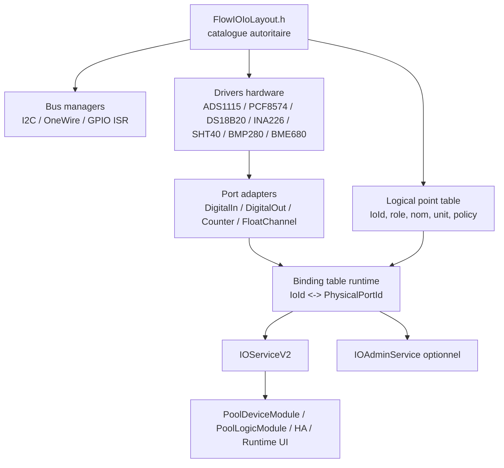

# IOModule v2 - etude de redesign profond

## 1. Perimetre

Ce document propose une architecture cible pour un refactor complet de `IOModule` cote Flow.IO.

Le perimetre couvert est:
- les entrees et sorties metier exposees au reste du firmware
- les GPIO directs ESP32
- les extensions de ports via I2C, notamment `PCF8574`
- les capteurs `DS18B20` sur bus OneWire
- les capteurs/modles I2C `INA226`, `SHT40`, `BMP280`, `BME680`
- les deux `ADS1115` presentes sur le bus I2C
- les compteurs sur interruption avec debounce et gestion montee / descente
- l'integration avec `PoolDeviceModule` et `PoolLogicModule` via un service IO stable

Le perimetre explicitement exclu est:
- la communication inter-ESP sur I2C entre Supervisor et Flow.IO
- la logique metier des pompes, deja portee par `PoolDeviceModule`

## 2. Contraintes structurantes

Les contraintes du projet sont fortes et doivent piloter l'architecture:

- cible `ESP32`
- pas d'usage runtime de `std::string`, `String`, `std::vector` ou conteneurs dynamiques
- heap dynamique interdite en regime nominal
- allocation statique au demarrage acceptable
- topologie compile-time acceptable, mais remapping runtime des ports necessaire
- strict decoupage entre:
  - couche driver hardware
  - couche d'abstraction/adaptation
  - couche de binding logique / metier
- les `IoId` logiques doivent rester stables meme si le port physique change
- les composants metier ne doivent pas connaitre le backend physique

Le projet possede deja de bons ancrages:
- service IO unifie: [src/Core/Services/IIO.h](/Users/christophebelmont/Documents/GitHub.nosync/Flow.io/src/Core/Services/IIO.h)
- profil / board / domain separes: [src/Profiles/FlowIO/FlowIOBootstrap.cpp](/Users/christophebelmont/Documents/GitHub.nosync/Flow.io/src/Profiles/FlowIO/FlowIOBootstrap.cpp), [src/Board/FlowIOBoardRev1.h](/Users/christophebelmont/Documents/GitHub.nosync/Flow.io/src/Board/FlowIOBoardRev1.h), [src/Domain/Pool/PoolDomain.h](/Users/christophebelmont/Documents/GitHub.nosync/Flow.io/src/Domain/Pool/PoolDomain.h)
- `PoolDeviceModule` est deja au-dessus de l'IO et ne consomme qu'un contrat logique: [src/Modules/PoolDeviceModule/PoolDeviceModule.h](/Users/christophebelmont/Documents/GitHub.nosync/Flow.io/src/Modules/PoolDeviceModule/PoolDeviceModule.h)
- `ConfigStore` fournit deja un socle persistant sans heap: [src/Core/ConfigStore.h](/Users/christophebelmont/Documents/GitHub.nosync/Flow.io/src/Core/ConfigStore.h)

## 3. Diagnostic sur l'existant

Le module actuel apporte deja:
- un service `IOServiceV2`
- des pools statiques
- des drivers `GPIO`, `ADS1115`, `DS18B20`, `PCF8574`
- un compteur GPIO sur interruption

Mais il presente plusieurs limites pour le perimetre cible:

- les slots logiques, les drivers et la config sont encore trop imbriques
- la topologie hardware n'est pas decrite comme un catalogue formel bus / devices / canaux / ports
- le remapping runtime passe encore trop pres des broches ou des definitions unitaires
- les capteurs multi-mesures I2C (`INA226`, `SHT40`, `BMP280`, `BME680`) ne rentrent pas naturellement dans le modele actuel
- le compteur actuel ne couvre pas proprement les fronts montants et descendants
- le modele actuel est calibre autour d'un petit nombre fixe de slots analogiques / digitaux, pas autour d'un parc heterogene de sources physiques

Conclusion: il faut conserver l'idee de service IO unifie, mais refaire le coeur interne autour d'un modele plus explicite:
- ressources physiques
- adapters de ports
- points logiques
- bindings runtime

## 4. Principes d'architecture proposes

### 4.1 Principes clefs

- `IoId` = identite logique stable consommee par les autres modules
- `PhysicalPortId` = identite physique ou pseudo-physique du backend
- les drivers ne connaissent ni les `IoId`, ni les noms metier, ni les calibrations metier
- les adapters convertissent un canal hardware en port generique exploitable
- les bindings relient un point logique a un port physique compatible
- la configuration runtime ne choisit jamais une broche brute librement
- la configuration runtime choisit un port dans une whitelist compile-time de ports autorises

### 4.2 Resultat vise

- `PoolDeviceModule` continue a piloter des sorties via `IoId`, sans savoir si la sortie est un GPIO direct ou un bit de `PCF8574`
- `PoolLogicModule` continue a lire ses mesures via `IoId`, sans savoir si la valeur vient d'un `ADS1115`, d'un `DS18B20`, d'un `INA226` ou d'un `BME680`
- le profil Flow.IO peut changer le cablage metier au runtime sans casser l'identite logique des points
- la topologie hardware reste entierement visible et verifiable au compile-time

## 5. Architecture cible



### 5.1 Couches

#### A. Couche transport / bus

Responsabilite:
- initialiser et serialiser l'acces aux bus
- gerer la synchronisation bas niveau
- ne contenir aucune logique metier

Classes candidates:
- `IoI2cBusManager`
- `IoOneWireBusManager`
- `IoGpioInterruptHub`

Remarques:
- le bus I2C doit rester mutualisable et verrouillable
- le hub d'interruptions GPIO doit etre tres leger et `IRAM_ATTR` cote ISR

#### B. Couche drivers hardware

Responsabilite:
- parler au composant reel
- exposer des canaux bruts ou des mesures de base
- encapsuler les details registres / timings / conversions bas niveau

Drivers proposes:
- `GpioInputDriver`
- `GpioOutputDriver`
- `GpioEdgeCaptureDriver`
- `Pcf8574Driver`
- `Ads1115Driver`
- `Ds18b20BusDriver`
- `Ina226Driver`
- `Sht40Driver`
- `Bmp280Driver`
- `Bme680Driver`

Regle stricte:
- pas de labels metier
- pas de `IoId`
- pas de JSON
- pas de `ConfigStore`
- pas de publication MQTT
- pas de logique "pompe", "niveau piscine", "temperature eau"

#### C. Couche adapters / abstraction de ports

Responsabilite:
- transformer un canal hardware en port exploitable de facon uniforme
- appliquer les transformations generiques, pas metier

Adapters proposes:
- `DigitalInputPortAdapter`
- `DigitalOutputPortAdapter`
- `CounterInputPortAdapter`
- `FloatInputPortAdapter`

Exemples de responsabilites adapter:
- inversion logique
- debounce generique
- mode pulse / momentary
- filtres simples de mesure
- calibration affine `y = a*x + b`
- bornes de validite
- gestion `available/stale/fault`

Regle stricte:
- un adapter peut connaitre `PhysicalPortId`
- un adapter ne connait pas le role metier final

#### D. Couche points logiques

Responsabilite:
- definir les points exposes aux autres modules
- porter l'identite logique stable et le contrat de service

Structure type:
- `IoId`
- type logique: `digital_in`, `digital_out`, `counter`, `analog`
- role metier optionnel
- unite / precision / affichage
- binding runtime vers un `PhysicalPortId`
- politique de publication / disponibilite

#### E. Couche facade service

Responsabilite:
- exposer `IOServiceV2`
- eventuellement exposer un service d'administration des bindings
- alimenter runtime UI / HA / snapshots

Services recommandes:
- conserver `IOServiceV2` pour compatibilite
- ajouter `IOAdminService` pour le remapping runtime et l'inspection des bindings

## 6. Modele de donnees recommande

### 6.1 Identites

Il faut separer clairement:

- `IoId`:
  - stable
  - visible des modules metier
  - persiste dans `PoolDeviceModule` / `PoolLogicModule`
- `PhysicalPortId`:
  - identifie une ressource physique candidate
  - peut changer a runtime dans la whitelist
- `DriverId`:
  - identifie une instance hardware
  - purement interne au module IO

### 6.2 Catalogue compile-time

Le coeur du redesign doit etre un catalogue statique unique, par exemple:

- fichier autoritaire propose:
  - `src/Profiles/FlowIO/FlowIOIoLayout.h`

Ce fichier decrit:
- les bus utilises
- les devices installes ou installables
- les ports physiques exposes par ces devices
- les points logiques publies au reste du firmware
- les bindings par defaut
- les compatibilites de remapping

Le but est que `FlowIOIoAssembly.cpp` devienne un simple bootstrap lisant ce catalogue.

### 6.3 Structures de base

Exemple de structures cibles:

```cpp
using PhysicalPortId = uint8_t;
using DriverId = uint8_t;

enum IoPhysicalKind : uint8_t {
    IO_PHYS_GPIO_DI,
    IO_PHYS_GPIO_DO,
    IO_PHYS_GPIO_COUNTER,
    IO_PHYS_PCF8574_DO,
    IO_PHYS_ADS1115_CH,
    IO_PHYS_DS18B20_TEMP,
    IO_PHYS_INA226_BUS_V,
    IO_PHYS_INA226_CURRENT,
    IO_PHYS_INA226_POWER,
    IO_PHYS_SHT40_TEMP,
    IO_PHYS_SHT40_RH,
    IO_PHYS_BMP280_TEMP,
    IO_PHYS_BMP280_PRESS,
    IO_PHYS_BME680_TEMP,
    IO_PHYS_BME680_RH,
    IO_PHYS_BME680_PRESS,
    IO_PHYS_BME680_GAS
};

struct IoPhysicalPortSpec {
    PhysicalPortId id;
    IoPhysicalKind kind;
    DriverId driverId;
    uint8_t channel;
    uint16_t capabilityMask;
    uint8_t flags;
    const char* label;
};

struct IoLogicalPointSpec {
    IoId ioId;
    uint8_t logicalType;
    uint8_t role;
    PhysicalPortId defaultBinding;
    const PhysicalPortId* allowedBindings;
    uint8_t allowedBindingCount;
    const char* name;
    uint8_t unit;
    int8_t precision;
};
```

La cle du design est `allowedBindings`:
- le runtime peut reconfigurer le point
- mais uniquement vers des ports compile-time compatibles
- pas de "pin libre" hors catalogue

## 7. Gestion des differents backends

### 7.1 GPIO directs ESP32

A reserver pour:
- entrees digitales simples
- sorties digitales directes
- compteurs sur interruption

Recommandations:
- utiliser une allowlist compile-time de GPIO autorises
- exclure par defaut les pins sensibles au boot strap ou a la flash
- conserver par port un `safeState` applique au boot

### 7.2 PCF8574

A utiliser pour:
- sorties digitales lentes
- relais, LED, actionneurs simples

A ne pas utiliser pour:
- compteurs
- entrees a haute frequence
- timing strict

Recommandations:
- driver conserve un shadow register local
- ecriture atomique par masque
- etat par defaut "safe off" lors de `begin()`
- option `activeLow` geree dans l'adapter, pas dans le metier

### 7.3 ADS1115 x2

Chaque `ADS1115` doit etre modele comme:
- 1 driver
- jusqu'a 4 canaux single-ended ou 2 canaux differentiels
- 1 port physique par canal expose

Regle importante:
- le driver gere l'acquisition et la conversion brute -> volts
- l'adapter gere la calibration metier:
  - ORP
  - pH
  - pression
  - autre capteur analogique

### 7.4 DS18B20

Le cas `DS18B20` doit etre traite comme un bus multi-capteurs et non comme deux drivers fixes.

Recommandation:
- `Ds18b20BusDriver` scanne le bus au boot dans un tableau statique
- chaque sonde est identifiee par son ROM code 64 bits
- le binding logique doit pointer vers:
  - un bus OneWire autorise
  - un ROM code persiste en config

Pourquoi:
- l'ordre d'index de decouverte n'est pas une identite stable
- le ROM code est l'identite physique robuste

Politique de decouverte recommandee:
- si `ow_rom_hex` est vide et qu'une seule sonde est detectee sur le bus autorise:
  - l'utiliser automatiquement
  - persister immediatement son ROM code
- si `ow_rom_hex` est vide et que plusieurs sondes sont detectees:
  - ne pas choisir arbitrairement
  - laisser le point non resolu
  - lever un warning explicite
- si un ROM code est deja configure et absent au boot:
  - ne pas rebasculer silencieusement vers une autre sonde
  - garder le point indisponible jusqu'a action explicite ou flag d'auto-rebind dedie

### 7.5 INA226

Le `INA226` est naturellement multi-mesures.

Mesures typiques a exposer comme points distincts:
- bus voltage
- shunt voltage si utile
- current
- power

Recommandation:
- le driver fait la conversion registre -> unite physique de base
- l'adapter applique les options projet:
  - precision
  - filtrage
  - bornes
  - publication

### 7.6 SHT40 / BMP280 / BME680

Ces capteurs doivent etre traites comme des "devices multi-canaux":

- `SHT40`:
  - temperature
  - humidite relative
- `BMP280`:
  - temperature
  - pression
- `BME680`:
  - temperature
  - humidite relative
  - pression
  - resistance gaz

Chaque mesure doit produire un `PhysicalPortId` distinct, meme si le driver sous-jacent est unique.

## 8. Gestion des compteurs sur interruption

### 8.1 Exigence fonctionnelle

Le nouveau module doit savoir:
- compter les fronts montants
- compter les fronts descendants
- gerer le debounce
- exposer si besoin:
  - le cumul montant
  - le cumul descendant
  - le cumul total
  - l'etat logique courant

### 8.2 Proposition technique

Separateur strict:

- `GpioEdgeCaptureDriver`
  - couche hardware
  - attache l'ISR
  - lit le niveau
  - applique un debounce minimal
  - incremente des compteurs atomiques statiques

- `CounterInputPortAdapter`
  - couche abstraction
  - expose la politique logique:
    - rising only
    - falling only
    - both
    - net
  - gere la presentation du compteur en `int32`

### 8.3 Etat recommande par canal

Par canal compteur, stockage statique:
- `volatile uint32_t risingCount`
- `volatile uint32_t fallingCount`
- `volatile uint32_t lastAcceptedEdgeUs`
- `volatile uint8_t lastStableLevel`
- `volatile uint8_t overflowFlag`

Avantages:
- pas de file dynamique
- pas de buffer variable
- ISR tres courte
- lecture stable cote task via section critique

### 8.4 Debounce

Le debounce doit etre defini par port logique, en microsecondes.

Politique conseillee:
- rejection symetrique des fronts recu trop tot apres le dernier front accepte
- configurable par point
- borne compile-time max pour eviter des valeurs aberrantes

### 8.5 Adaptation compteur -> grandeur physique

Oui, le `CounterInputPortAdapter` doit pouvoir porter une petite couche d'adaptation de type:

- `value = raw_count * c0 + c1`

Cas d'usage typiques:
- debimetre a impulsions -> volume
- compteur d'energie impulsionnel -> Wh ou kWh
- detecteur evenementiel -> nombre d'actions physiques equivalentes

Recommandation d'implementation:
- le driver et l'ISR ne manipulent que le compteur brut
- l'adapter applique la conversion hors ISR
- si l'on veut eviter le float dans les chemins chauds, stocker `c0` en fixe:
  - `scale_num / scale_den`
  - ou `Q16.16` / `Q24.8`

Important:
- persister de preference le compteur brut monotone
- recalculer la grandeur derivee a la lecture ou au publish
- cela evite les derives et simplifie un changement de `c0`

## 9. Strategie memoire et allocation

### 9.1 Regle generale

Pas de heap runtime pour:
- creation de driver
- creation de port
- creation de point logique
- listes de bindings
- filtres

### 9.2 Ce qui est acceptable

- tableaux statiques globaux
- pools statiques avec `placement new`
- petites allocations uniques au boot si vraiment necessaire, puis zero allocation ensuite

### 9.3 Capacites compile-time a definir

Exemple de capacites a poser dans `SystemLimits` ou un header IO dedie:

- `IO_MAX_BUSES`
- `IO_MAX_DRIVERS`
- `IO_MAX_PHYSICAL_PORTS`
- `IO_MAX_LOGICAL_POINTS`
- `IO_MAX_COUNTER_PORTS`
- `IO_MAX_DS18B20_PROBES`
- `IO_MAX_ALLOWED_BINDINGS_PER_POINT`

### 9.4 Pattern recommande

Le plus robuste ici est un modele "POD + tableaux + ops tables" ou des classes triviales placees en pool statique.

Je recommande:
- pas d'arbre d'objets complexe
- pas d'heritage profond cote points logiques
- des structs compactes avec dispatch par enum / petites vtables statiques

### 9.5 Impact DRAM attendu

Le modele propose n'augmente pas mecaniquement la DRAM si l'on respecte trois regles:

- le catalogue compile-time (`FlowIOIoLayout.h`, allowlists, tables de compatibilite) doit etre `constexpr` et rester en flash / rodata
- les structures runtime doivent etre compactes:
  - table de bindings
  - etat courant des points
  - etat des drivers
- il ne faut pas recreer un `ConfigVariable<>` par detail hardware compile-time inutile

Le plus gros risque DRAM n'est pas le catalogue de ports.
Le plus gros risque DRAM est:
- la multiplication des `ConfigVariable<>` membres dans `IOModule`
- et la taille reservee par `ConfigStore::_meta[Limits::MaxConfigVars]`

Dans l'existant:
- `Limits::MaxConfigVars = 315`
- cette capacite reserve la table meta complete dans `ConfigStore`, meme si toutes les cases ne sont pas utilisees

Conclusion pratique:
- si le nouveau design reduit vraiment le nombre total de variables de config, il faudra aussi baisser `Limits::MaxConfigVars`
- sinon on gagnera surtout sur la RAM du module IO lui-meme, mais peu sur la table meta globale

## 10. Service public recommande

### 10.1 Conserver `IOServiceV2`

Le plus important pour limiter l'impact systeme est de conserver le contrat actuel:
- `count`
- `idAt`
- `meta`
- `readValue`
- `readDigital`
- `writeDigital`
- `readAnalog`
- `tick`
- `lastCycle`

Fichier impacte: [src/Core/Services/IIO.h](/Users/christophebelmont/Documents/GitHub.nosync/Flow.io/src/Core/Services/IIO.h)

### 10.2 Etendre les metadonnees

Le contrat actuel peut rester stable, mais les metadonnees devraient etre enrichies d'une des deux facons:

- option A, simple:
  - etendre `IoEndpointMeta`
  - ajouter `unit`, `measureClass`, `bindingPortId`, `available`

- option B, plus propre:
  - laisser `IOServiceV2` quasi inchange
  - ajouter un `IOAdminService` / `IOCatalogService`

Je recommande l'option B.

### 10.3 Service d'administration conseille

```cpp
struct IOAdminService {
    IoStatus (*getBinding)(void* ctx, IoId ioId, PhysicalPortId* outPortId);
    IoStatus (*setBinding)(void* ctx, IoId ioId, PhysicalPortId portId);
    IoStatus (*listBindings)(void* ctx, IoId ioId, PhysicalPortId* outIds, uint8_t max, uint8_t* outCount);
    IoStatus (*describePort)(void* ctx, PhysicalPortId portId, IoPhysicalPortInfo* outInfo);
    void* ctx;
};
```

Usage:
- HMI
- config distante
- debug
- migration

Pas besoin pour `PoolDeviceModule`.

## 11. Configuration `ConfigStore`

### 11.1 Principe general

La configuration doit etre decoupee en trois niveaux:

- config module globale
- config devices / bus
- config points logiques

### 11.2 Branches recommandees

Proposition de structure de branches:

- `io`
  - enable, debug, scheduler, policies globales
- `io/bus/i2c0`
  - sda, scl, freq
- `io/dev/ads0`
- `io/dev/ads1`
- `io/dev/pcf0`
- `io/dev/ina0`
- `io/dev/sht0`
- `io/dev/bmp0`
- `io/dev/bme0`
- `io/dev/ow0`
- `io/pt/p0`
- `io/pt/p1`
- `io/pt/p2`
- etc.

Ou, si l'on veut rester tres compact:

- `io`
- `io/debug`
- `io/dev/d0..dN`
- `io/pt/p0..pN`

### 11.3 Variables globales recommandees

- `enabled`
- `trace_enabled`
- `trace_period_ms`
- `fast_poll_ms`
- `medium_poll_ms`
- `slow_poll_ms`
- `reprobe_period_ms`
- `stale_timeout_ms`

### 11.4 Variables bus / device recommandees

Exemples:

- I2C bus:
  - `sda`
  - `scl`
  - `freq_hz`

- ADS1115:
  - `enabled`
  - `address`
  - `gain`
  - `rate`
  - `poll_ms`

- PCF8574:
  - `enabled`
  - `address`
  - `default_mask`

- INA226:
  - `enabled`
  - `address`
  - `avg_count`
  - `conv_time`
  - `poll_ms`

- SHT40 / BMP280 / BME680:
  - `enabled`
  - `address`
  - `poll_ms`
  - eventuellement `oversampling` / `heater` / `filter`, selon le driver retenu

- OneWire:
  - `enabled`
  - `bus_pin` si pas deja fige board-side
  - `poll_ms`

### 11.5 Variables par point logique recommandees

Communes:
- `enabled`
- `binding_port`
- `name`
- `precision`
- `publish_enable`

Specifiques analogiques:
- `scale_a`
- `scale_b`
- `min_valid`
- `max_valid`
- `filter_kind`
- `filter_window`

Specifiques sortie digitale:
- `active_high`
- `default_on`
- `momentary`
- `pulse_ms`
- `safe_state`

Specifiques entree digitale:
- `active_high`
- `pull_mode`

Specifiques compteur:
- `edge_mode`
- `debounce_us`
- `counter_mode`

Specifiques DS18B20:
- `ow_rom_hex`

### 11.6 Stockage des identites physiques

Recommandation:
- `binding_port` stocke un `PhysicalPortId`
- `ow_rom_hex` stocke le ROM code pour les ports DS18B20 a resolution runtime

Pourquoi ne pas stocker un numero de pin brut:
- trop dangereux
- difficile a valider
- fort risque sur ESP32
- pas compatible avec les ports externes I2C

### 11.7 Contraintes `NVS`

Le systeme actuel limite les cles NVS a 15 caracteres via [src/Core/ConfigTypes.h](/Users/christophebelmont/Documents/GitHub.nosync/Flow.io/src/Core/ConfigTypes.h).

Il faudra donc une nomenclature compacte, par exemple:

- global:
  - `io_en`
  - `io_tren`
  - `io_trms`
- device:
  - `iad0ad` = ads0 address
  - `ipc0ad` = pcf0 address
  - `ina0ad` = ina226 address
- point:
  - `ip00bd` = point 0 binding
  - `ip00en` = point 0 enabled
  - `ip00a0` = point 0 scale_a
  - `ip00a1` = point 0 scale_b
  - `ip00db` = point 0 debounce

### 11.8 Comparaison avec l'existant et budget recommande

Le module IO actuel est deja tres couteux en `ConfigStore`.

Ordre de grandeur de l'existant:
- config globale IO: `16` variables
- analogiques: `6 x 8 = 48` variables
- entrees digitales: `5 x 4 = 20` variables
- sorties digitales: `8 x 6 = 48` variables
- total `IOModule` actuel: `132` variables

Autrement dit:
- le seul module IO consomme deja environ `42%` du budget global de `315`

Ordre de grandeur du profil Flow.IO actuel:
- `IOModule`: `132`
- `PoolDeviceModule`: `64`
- `PoolLogicModule`: `51`
- autres modules principaux du profil: environ `35 a 40`
- total profil: environ `282 a 287`

Conclusion:
- le headroom actuel est faible
- une implementation naive du nouveau modele ferait probablement depasser la capacite actuelle

Budget recommande pour `IOModule v2`:
- cible ideale: `<= 80` variables
- borne haute acceptable: `<= 96`
- au-dela, le gain architectural deviendra tres difficile a tenir cote `ConfigStore`

Recommandations pour tenir ce budget:
- ne pas persister les proprietes purement compile-time:
  - inventaire hardware
  - type de capteur
  - allowlists de ports
  - adresses fixes si elles ne sont pas censees bouger
- ne persister que les proprietes vraiment runtime / utilisateur:
  - binding physique
  - calibration
  - quelques policies d'activation
  - runtime blobs des compteurs si necessaire
- ne pas donner a tous les points le meme sous-ensemble de variables
- factoriser les parametres avances par type de point ou par driver
- utiliser 1 blob runtime par compteur / point complexe plutot que 4 ou 5 variables separees si cela ne nuit pas a l'exploitation

Corollaire important:
- si `IOModule v2` descend vraiment vers `80` variables, il deviendra possible de reduire `Limits::MaxConfigVars`
- cela liberera de la DRAM non seulement dans le module, mais aussi dans le coeur `ConfigStore`

## 12. Fichier autoritaire de cablage

Tu demandais que les details de board et de cablage metier soient portes dans un fichier precis.

Je recommande:

- fichier autoritaire unique:
  - `src/Profiles/FlowIO/FlowIOIoLayout.h`

Il contiendra:
- les devices hardware effectivement presents sur la carte Flow.IO
- les ports physiques exposes
- les bindings logiques par defaut
- les allowlists de remapping
- les policies de securite de boot

Et il remplacera le role "metier + montage" aujourd'hui disperse entre:
- [src/Board/FlowIOBoardRev1.h](/Users/christophebelmont/Documents/GitHub.nosync/Flow.io/src/Board/FlowIOBoardRev1.h)
- [src/Profiles/FlowIO/FlowIOIoAssembly.cpp](/Users/christophebelmont/Documents/GitHub.nosync/Flow.io/src/Profiles/FlowIO/FlowIOIoAssembly.cpp)
- [src/Domain/Pool/PoolBindings.h](/Users/christophebelmont/Documents/GitHub.nosync/Flow.io/src/Domain/Pool/PoolBindings.h)

Mon conseil pratique:
- garder `BoardSpec` pour les pins brutes de la carte
- faire de `FlowIOIoLayout.h` la source autoritaire sur la topologie IO exploitee par le firmware

## 13. Integration avec `PoolDeviceModule`

Objectif:
- aucune logique pompe dans `IOModule`
- integration propre avec `PoolDeviceModule`

Regle:
- `PoolDeviceModule` ne voit que des `IoId` de sorties digitales
- le mapping `PoolDevice slot -> IoId` reste stable
- le binding `IoId -> PhysicalPortId` peut changer sans impact sur `PoolDeviceModule`

Cela respecte deja le contrat visible dans:
- [src/Modules/PoolDeviceModule/PoolDeviceControl.cpp](/Users/christophebelmont/Documents/GitHub.nosync/Flow.io/src/Modules/PoolDeviceModule/PoolDeviceControl.cpp)

Consequence:
- le refactor IO peut etre profond sans destabiliser la logique domaine des pompes

## 14. Politique de disponibilite et fautes

Il faut sortir d'un modele "tout le module est OK ou KO".

Je recommande:
- etat de sante par driver
- disponibilite par point logique
- derniere erreur simple par driver
- reprobe periodique uniquement pour les devices optionnels I2C

Politique conseillee:
- un capteur absent rend uniquement ses points indisponibles
- un `PCF8574` absent rend indisponibles les sorties qui en dependent
- `IOServiceV2` retourne `IO_ERR_NOT_READY` ou `IO_ERR_HW` selon le cas
- les snapshots runtime indiquent `available=false`

### 14.1 Persistance des compteurs

Les compteurs reboot-proof ne doivent pas revenir a zero si leur sens metier est celui d'un total monotone.

Je recommande de separer clairement:

- responsabilite `IOModule`:
  - compter proprement
  - exposer un total technique monotone
  - persister ce total technique
- responsabilite des couches superieures:
  - calculs metier derives
  - remises a zero journalieres / hebdo / mensuelles
  - alarmes et interpretations metier

Donc:
- la persistance du compteur brut ne doit pas etre deleguee a `PoolLogicModule`
- elle doit vivre dans `IOModule`, idealement dans un petit sous-composant interne de type `CounterRuntimeStore`

Pourquoi:
- le compteur physique existe independamment du metier piscine
- plusieurs couches peuvent vouloir le lire
- la logique d'impulsions, de debounce et d'integrite est deja dans l'IO

### 14.2 Strategie concrete de persistance compteur

Sur chaque point compteur persistant, maintenir en RAM:
- `persistedRawTotal`
- `sessionDelta`
- `lastFlushMs`
- `persistDirty`

Formule exposee:
- `rawTotal = persistedRawTotal + sessionDelta`
- `scaledValue = rawTotal * c0 + c1`

Politique de flush NVS recommandee:
- flush periodique, pas a chaque impulsion
- exemple:
  - toutes les `60s`
  - ou a partir d'un delta mini de pulses
  - ou sur transition vers un etat idle stable

Tradeoff assume:
- on accepte une perte maximale egale au delta non encore flushe
- si la perte doit etre strictement nulle, la flash NVS n'est pas le bon backend

Dans ce cas extreme, il faudrait:
- soit un support plus adapte type FRAM
- soit un besoin produit revu

### 14.3 Format de persistence recommande

Avec le `ConfigStore` actuel, deux options sont robustes:

- option A:
  - ajouter un vrai support `UInt32` / `UInt64`
  - persister le compteur brut directement

- option B:
  - reutiliser le pattern `runtime blob`
  - 1 variable `CharArray` par compteur persistant
  - exemple de format: `v1,<raw_total>,<last_flush_ms>`

Pour limiter le nombre de variables, l'option B est tres bonne si l'on reste sur peu de compteurs.
Pour la proprete API, l'option A est meilleure si l'on accepte de faire evoluer `ConfigStore`.

## 15. Scheduler cible

Le scheduler doit etre pilote par classes de latence, pas par endpoint metier.

Je recommande quatre familles:

- `fast`
  - GPIO polling leger
  - ADS1115
  - INA226 si besoin rapide
- `medium`
  - SHT40
  - BMP280
  - BME680
- `slow`
  - DS18B20 conversion + read
- `maintenance`
  - reprobe I2C
  - diagnostics
  - publication de sante

Le scheduler lui-meme doit etre statique:
- tableau de jobs fixe
- pas de creation runtime de jobs

## 16. Proposition d'arborescence code

```text
src/Modules/IOModule2/
  IOModule2.h
  IOModule2.cpp
  IoTypes.h
  IoCatalog.h
  IoBindingTable.h
  IoScheduler.h
  IoMemory.h
  Services/
    IOAdminService.h
  Bus/
    IoI2cBusManager.h
    IoOneWireBusManager.h
    IoGpioInterruptHub.h
  Drivers/
    GpioInputDriver.h
    GpioOutputDriver.h
    GpioEdgeCaptureDriver.h
    Pcf8574Driver.h
    Ads1115Driver.h
    Ds18b20BusDriver.h
    Ina226Driver.h
    Sht40Driver.h
    Bmp280Driver.h
    Bme680Driver.h
  Adapters/
    DigitalInputPortAdapter.h
    DigitalOutputPortAdapter.h
    CounterInputPortAdapter.h
    FloatInputPortAdapter.h
```

Si l'on souhaite limiter le churn, le module peut garder le nom `IOModule` et seulement adopter cette decomposition interne.

## 17. Strategie de migration

Je recommande une migration en 6 etapes.

### Etape 1

Stabiliser les contrats publics:
- conserver `IOServiceV2`
- definir `PhysicalPortId`
- definir `FlowIOIoLayout.h`

### Etape 2

Introduire le nouveau coeur interne sans supprimer l'ancien:
- bus managers
- drivers
- binding table

### Etape 3

Migrer les sorties digitales:
- GPIO directs
- `PCF8574`
- validation `PoolDeviceModule`

### Etape 4

Migrer les entrees digitales et compteurs:
- etats simples
- compteurs montant / descendant
- validation debounce

### Etape 5

Migrer les entrees analogiques / multi-mesures:
- `ADS1115`
- `DS18B20`
- `INA226`
- `SHT40`
- `BMP280`
- `BME680`

### Etape 6

Migrer runtime snapshots, HA et HMI sur les metadonnees du nouveau catalogue.

## 18. Decisions fortes recommandees

Je recommande sans ambiguite les decisions suivantes:

- conserver `IoId` comme identite logique stable
- introduire un `PhysicalPortId` distinct
- interdire le mapping runtime direct par numero de pin nu
- porter le cablage IO autoritaire dans `FlowIOIoLayout.h`
- traiter `DS18B20` par ROM code, pas par index de scan
- traiter chaque mesure multi-capteur comme un port physique distinct
- sortir la logique de debounce / edge policy dans un adapter compteur propre
- conserver `IOServiceV2` pour limiter le rayon d'impact
- ajouter un `IOAdminService` pour le remapping runtime

## 19. Risques et points de vigilance

- explosion du nombre de variables `ConfigStore` si chaque point porte trop d'options
- risque de confusion entre "port physique" et "point logique" si les noms ne sont pas stricts
- `PCF8574` non adapte aux usages temps reel ou compteurs
- `DS18B20` necessite une strategie claire de ROM persistence
- `BME680` peut ajouter du cout CPU / timing selon la lib choisie
- il faut proteger fortement la table de GPIO autorises sur ESP32

## 20. Synthese executive

L'architecture la plus robuste pour Flow.IO est:

- un catalogue IO statique compile-time
- un service logique stable consomme par le metier
- des bindings runtime entre points logiques et ports physiques autorises
- des drivers purement hardware
- des adapters qui portent calibration, filtrage, debounce et policies generiques
- une configuration `ConfigStore` organisee par module, device et point logique

Autrement dit:
- le metier raisonne en `IoId`
- le hardware raisonne en `PhysicalPortId`
- le module IO fait le pont, sans heap runtime et sans melanger les niveaux
