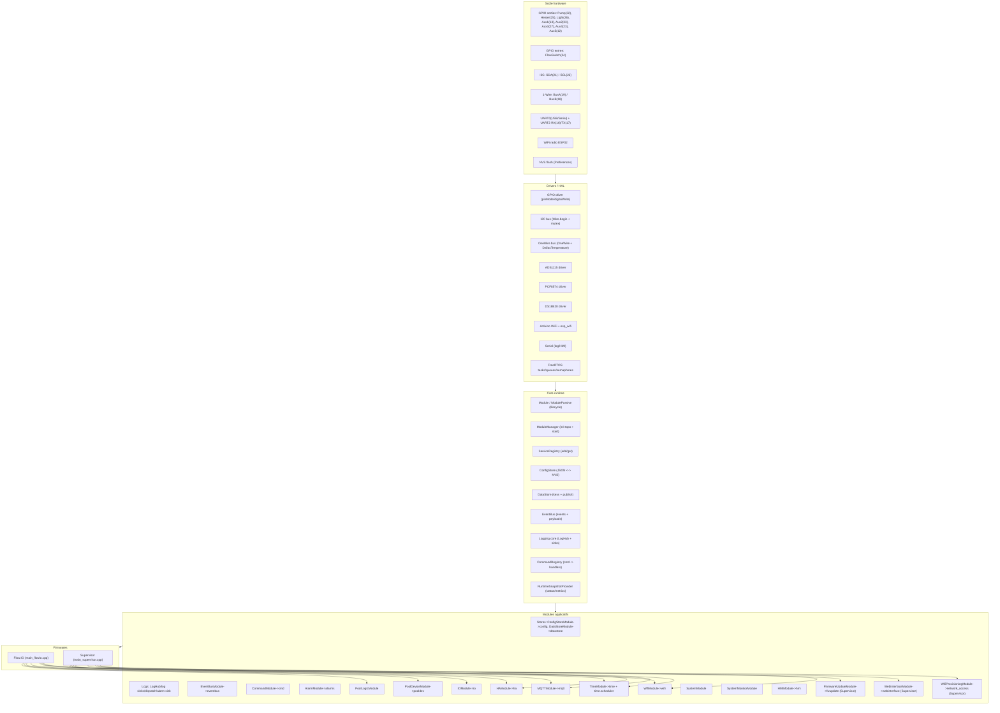

```mermaid
flowchart TB

%% Layer 0: Hardware
subgraph L0["Socle hardware"]
  HW1["GPIO sorties: Pump(32), Heater(25), Light(26), Aux1(13), Aux2(33), Aux3(27), Aux4(23), Aux5(12)"]
  HW2["GPIO entree: FlowSwitch(34)"]
  HW3["I2C: SDA(21) / SCL(22)"]
  HW4["1-Wire: BusA(19) / BusB(18)"]
  HW5["UART0(USB/Serial) + UART2 RX(16)/TX(17)"]
  HW6["WiFi radio ESP32"]
  HW7["NVS flash (Preferences)"]
end

%% Layer 1: Drivers / HAL
subgraph L1["Drivers / HAL"]
  D1["GPIO driver (pinMode/digitalWrite)"]
  D2["I2C bus (Wire.begin + mutex)"]
  D3["OneWire bus (OneWire + DallasTemperature)"]
  D4["ADS1115 driver"]
  D5["PCF8574 driver"]
  D6["DS18B20 driver"]
  D7["Arduino WiFi + esp_wifi"]
  D8["Serial (log/HMI)"]
  D9["FreeRTOS tasks/queues/semaphores"]
end

%% Layer 2: Core runtime
subgraph L2["Core runtime"]
  C1["Module / ModulePassive (lifecycle)"]
  C2["ModuleManager (init topo + start)"]
  C3["ServiceRegistry (add/get)"]
  C4["ConfigStore (JSON <-> NVS)"]
  C5["DataStore (keys + publish)"]
  C6["EventBus (events + payloads)"]
  C7["Logging core (LogHub + sinks)"]
  C8["CommandRegistry (cmd -> handlers)"]
  C9["RuntimeSnapshotProvider (status/metrics)"]
end

%% Layer 3: Modules
subgraph L3["Modules applicatifs"]
  MStores["Stores: ConfigStoreModule->config, DataStoreModule->datastore"]
  MLogs["Logs: LogHub/log sinks/dispatch/alarm sink"]
  MEB["EventBusModule->eventbus"]
  MCmd["CommandModule->cmd"]
  MAlarm["AlarmModule->alarms"]
  MWiFi["WifiModule->wifi"]
  MTime["TimeModule->time + time.scheduler"]
  MMqtt["MQTTModule->mqtt"]
  MHA["HAModule->ha"]
  MIO["IOModule->io"]
  MPoolDev["PoolDeviceModule->pooldev"]
  MPoolLogic["PoolLogicModule"]
  MSys["SystemModule"]
  MSysMon["SystemMonitorModule"]
  MHMI["HMIModule->hmi"]
  MProv["WifiProvisioningModule->network_access (Supervisor)"]
  MWeb["WebInterfaceModule->webinterface (Supervisor)"]
  MFW["FirmwareUpdateModule->fwupdate (Supervisor)"]
end

%% Layer 4: Applications
subgraph L4["Firmwares"]
  AFlow["Flow.IO (main_flowio.cpp)"]
  ASup["Supervisor (main_supervisor.cpp)"]
end

%% Layer wiring
L0 --> L1 --> L2 --> L3 --> L4

%% Conceptual dependencies (examples)
AFlow --> MWiFi
AFlow --> MTime
AFlow --> MMqtt
AFlow --> MHA
AFlow --> MIO
AFlow --> MPoolDev
AFlow --> MPoolLogic

ASup --> MWiFi
ASup --> MProv
ASup --> MWeb
ASup --> MFW
ASup --> MMqtt
ASup --> MTime
ASup --> MHA
```
